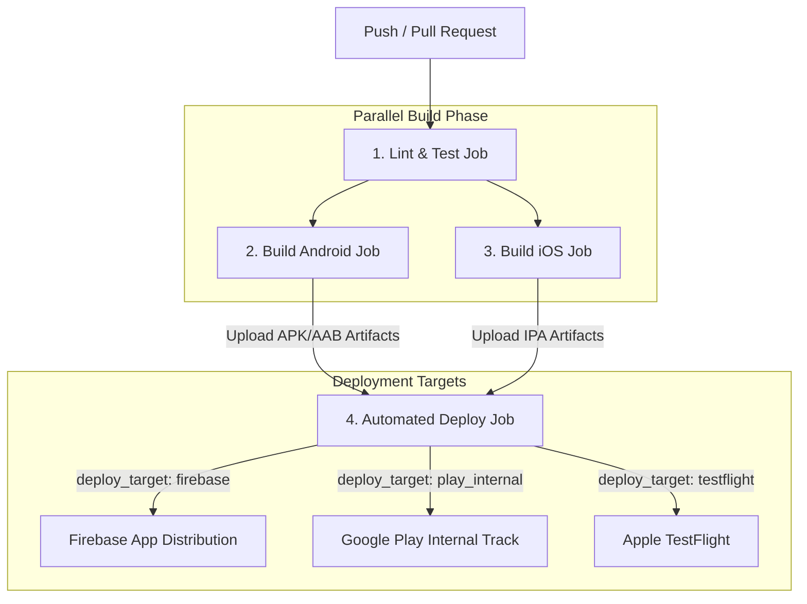

# Mobile CI/CD Reusable Workflows & Interactive CLI 🚀

[](https://github.com/gk182/ci-templates/actions)
[](https://flutter.dev)
[](https://fastlane.tools)
[](LICENSE)
[](CONTRIBUTING.md)

An end-to-end, zero-config **Mobile CI/CD Pipeline Generator and Reusable GitHub Actions Workflow** tailored for **Flutter, Native Android, and Native iOS** projects.

Setup your entire build, test, and automated release pipeline to **Firebase App Distribution, Google Play Console, and Apple TestFlight** in under **30 seconds** with **~10 lines of YAML**.

---

## ✨ Key Features

- ⚡ **Zero-Config Interactive CLI**: Generate fully customized GitHub Actions workflows using an interactive terminal interface (`npx`).
- 🔍 **Auto SDK & Version Detection**: Automatically parses `pubspec.yaml` and environment variables to match your exact Flutter SDK version.
- 📦 **Multi-Tier Pipeline Caching**: Pre-configured caching for **Flutter Pub**, **Gradle**, and **CocoaPods**—reducing build times from **8–10 minutes down to 2–3 minutes**.
- 🔐 **Secure Credential Decoding**: Automatically decodes Base64 keystores, service accounts, and API keys at runtime without committing secrets.
- 🚀 **Multi-Target Deployment**: Support for Firebase App Distribution, Google Play Internal Testing, and Apple TestFlight via Fastlane.
- 🛡️ **Fail-Fast Defensive Execution**: Provides crystal-clear error messages and links to documentation when secrets or parameters are missing.

---

## ⚡ Quick Start

Run the interactive CLI directly inside your mobile application root directory:

```bash
npx github:gk182/ci-templates
```

### 🖥️ Interactive CLI Preview

```text
┌──────────────────────────────────────────────────────────┐
│  MOBILE CI/CD WORKFLOW GENERATOR (gk182/ci-templates)    │
└──────────────────────────────────────────────────────────┘

● Detected Flutter Version: 3.29.0

? Select CI/CD Pipeline Configuration: (Use ↑ ↓ keys, Enter to confirm)

  ❯ Flutter Basic          Build APK artifacts on Push/PR (No auto deployment)
    Flutter Multi-Branch   develop -> Firebase App Distribution, main -> Play Store / TestFlight
    Flutter Tag Release    Auto Deploy to Stores only when pushing Git Tags (v*.*.*)
    Native Android         Pure Android Studio Project (Gradle / Kotlin / Java)
    Native iOS             Pure Xcode Project (Swift / Fastlane / TestFlight)
```

The CLI automatically:
1. 🔍 Detects your local / project **Flutter SDK version**.
2. ⚡ Generates `.github/workflows/ci.yml` pre-configured for your project architecture.
3. 📝 Creates a standardized `release_notes.txt` template for store deployment release logs.

---

## 🔄 Pipeline Architecture



---

## 📁 Repository Structure

```text
ci-templates/
├── bin/
│   └── init.js                 # Interactive CLI generator (npx runner)
├── .github/workflows/
│   └── mobile-ci.yml           # Central Reusable Workflow (Entrypoint)
├── fastlane/
│   ├── Fastfile                # Fastlane deployment automation engine
│   ├── Pluginfile               # Fastlane plugin declarations
│   ├── Appfile.example         # App bundle/package ID template
│   └── Matchfile.example       # iOS Fastlane Match certificate template
├── scripts/
│   ├── setup-flutter.sh        # SDK setup and pub dependency caching
│   ├── run-tests.sh            # Flutter analyze & unit test runner
│   ├── build-android.sh        # Release APK / AAB builder
│   ├── build-ios.sh            # IPA archiver & builder
│   └── decode-credentials.sh   # Base64 secret decoder utility
├── docs/                       # Comprehensive step-by-step setup guides
└── examples/                   # Preset workflow configuration templates
```

---

## 📖 Setup & Configuration Guides

Detailed guides for setting up service accounts and credentials:

| Guide | Description |
|---|---|
| 📘 [`docs/00-tong-quan-fastlane.md`](docs/00-tong-quan-fastlane.md) | Fastlane architecture & local test execution |
| 🤖 [`docs/01-setup-play-store.md`](docs/01-setup-play-store.md) | Google Play Console Service Account & API Key Setup |
| 🍎 [`docs/02-setup-testflight.md`](docs/02-setup-testflight.md) | App Store Connect API & Fastlane Match Setup |
| 🔥 [`docs/03-setup-firebase.md`](docs/03-setup-firebase.md) | Firebase App Distribution Service Account Setup |
| 🛠️ [`docs/04-troubleshooting.md`](docs/04-troubleshooting.md) | Frequently encountered CI/CD errors & fixes |

---

## 📋 Workflow Input Parameters (`with:`)

| Input Parameter | Data Type | Required | Default | Description |
|---|---|---|---|---|
| `project_type` | `string` | **Yes** | — | Project type: `flutter`, `android`, or `ios`. |
| `flutter_version` | `string` | No | `"3.24.0"` | Flutter SDK version used during build. |
| `build_ios` | `boolean` | No | `false` | Enables iOS build on `macos-14` runner. |
| `run_deploy` | `boolean` | No | `false` | Enables store deployment step. |
| `deploy_target` | `string` | No | `"none"` | Target: `firebase`, `play_internal`, `testflight`, or `none`. |

---

## 🔐 Required Secrets Reference (`secrets:`)

Declare only the secrets required for your active target platforms in **Settings ➔ Secrets and variables ➔ Actions**:

| Secret Name | Category | Description & Purpose | Setup Guide |
|---|---|---|---|
| `ANDROID_KEYSTORE_BASE64` | Android Build | Base64 encoded Keystore file used for signing release APK/AAB | — |
| `ANDROID_KEYSTORE_PASSWORD` | Android Build | Passphrase to decrypt Keystore | — |
| `PLAY_STORE_JSON_KEY_BASE64` | Google Play | Base64 encoded Service Account JSON key for Google Play API | [`docs/01-setup-play-store.md`](docs/01-setup-play-store.md) |
| `ANDROID_PACKAGE_NAME` | Google Play | Application package name (e.g., `com.example.myapp`) | [`docs/01-setup-play-store.md`](docs/01-setup-play-store.md) |
| `FIREBASE_APP_ID` | Firebase | Firebase App ID from Console (e.g., `1:1234:android:abcd`) | [`docs/03-setup-firebase.md`](docs/03-setup-firebase.md) |
| `FIREBASE_SERVICE_ACCOUNT_BASE64` | Firebase | Base64 encoded Firebase Service Account JSON key | [`docs/03-setup-firebase.md`](docs/03-setup-firebase.md) |
| `FIREBASE_TESTER_GROUP` | Firebase | *(Optional)* Tester group name (Default: `internal-testers`) | [`docs/03-setup-firebase.md`](docs/03-setup-firebase.md) |
| `APP_STORE_CONNECT_API_KEY_BASE64` | TestFlight | Base64 encoded App Store Connect Private API key (`.p8`) | [`docs/02-setup-testflight.md`](docs/02-setup-testflight.md) |
| `APP_STORE_CONNECT_KEY_ID` | TestFlight | Key ID generated on App Store Connect | [`docs/02-setup-testflight.md`](docs/02-setup-testflight.md) |
| `APP_STORE_CONNECT_ISSUER_ID` | TestFlight | Issuer ID of your Apple Developer Organization | [`docs/02-setup-testflight.md`](docs/02-setup-testflight.md) |
| `MATCH_PASSWORD` | TestFlight | Passphrase to decrypt Fastlane Match certificates | [`docs/02-setup-testflight.md`](docs/02-setup-testflight.md) |
| `MATCH_GIT_URL` | TestFlight | Private Git URL holding Fastlane Match encrypted certificates | [`docs/02-setup-testflight.md`](docs/02-setup-testflight.md) |

---

## 📝 Release Notes Management

Fastlane automatically inspects your application repository for release notes during deployment:
* Fastlane reads release logs directly from `release_notes.txt` located in your repository root.
* If `release_notes.txt` is missing, Fastlane automatically uses your **latest Git commit message** as the release changelog!

---

## 🤝 Contributing

Contributions, issues, and feature requests are welcome! Feel free to check out the [issues page](https://github.com/gk182/ci-templates/issues).

---

## 📄 License

This project is licensed under the **MIT License** - see the [LICENSE](LICENSE) file for details.
